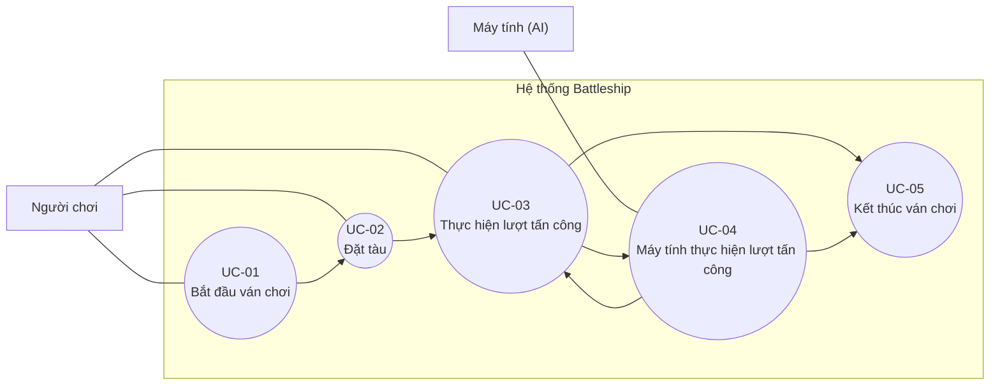

# Use Case Diagram

**Dự án:** Trò chơi Battleship  
**Phiên bản:** 1.0  
**Ngày:** 2026-04-21

---

## Tổng quan

Sơ đồ dưới đây mô tả use case diagram tổng của hệ thống Battleship ở phạm vi phiên bản 1. Sơ đồ thể hiện hai actor chính là Người chơi và Máy tính (AI), cùng các use case cốt lõi của luồng chơi từ bắt đầu ván, đặt tàu, thực hiện tấn công theo lượt cho đến khi kết thúc ván chơi.

---

## Mermaid diagram

---

## Ghi chú đọc sơ đồ

- Người chơi là actor khởi tạo và tham gia trực tiếp vào các use case chính của ván chơi.
- Máy tính (AI) tham gia ở use case thực hiện lượt tấn công của máy.
- UC-05 được kích hoạt như kết quả logic của các lượt tấn công khi điều kiện kết thúc ván chơi được thỏa mãn.
- Sơ đồ ưu tiên tính rõ ràng và nhất quán với URD hơn là mô phỏng đầy đủ mọi ký pháp UML chi tiết.
