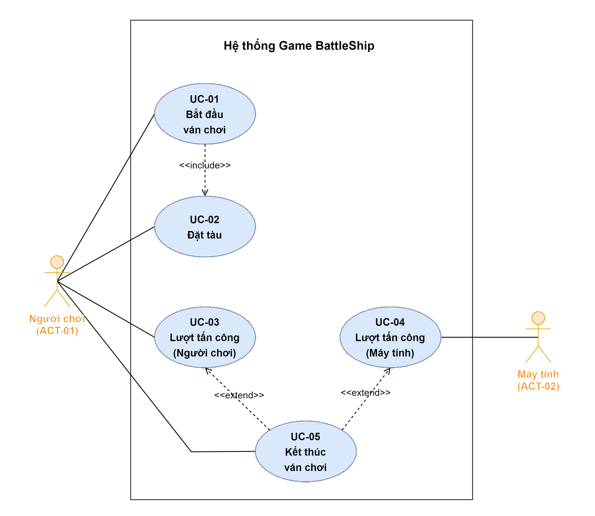

# Use Case Diagram

**Dự án:** Trò chơi Battleship  
**Phiên bản:** 2.0  
**Ngày tạo:** 21-04-2026  
**Ngày cập nhật:** 27-04-2026  
**Tài liệu nguồn:** `document/user-requirements.md` (URD §6 — Actor và Use Case)

---

## 1. Tổng Quan

Sơ đồ Use Case mô tả tương tác giữa các actor và hệ thống Battleship ở phạm vi phiên bản 1. Sơ đồ tuân theo ký pháp UML chuẩn:

- **Actor** được biểu diễn bằng hình chữ nhật có nhãn `«actor»`.
- **Use Case** được biểu diễn bằng hình elip (oval).
- **System Boundary** được biểu diễn bằng khung bao quanh các use case.
- **Association** (liên kết actor–use case) được biểu diễn bằng đường nét liền không mũi tên.
- **«include»** được biểu diễn bằng mũi tên nét đứt từ use case nguồn → use case bị bao gồm.
- **«extend»** được biểu diễn bằng mũi tên nét đứt từ use case mở rộng → use case cơ sở.
- **Generalization** (tổng quát hóa) giữa use case được biểu diễn bằng mũi tên rỗng đầu (Mermaid: `--|>`).

---

## 2. Actor Và Use Case (Tham Chiếu URD §6)

| ID | Tên | Loại | Vai trò |
|---|---|---|---|
| ACT-01 | Người chơi (Player) | Actor chính | Khởi tạo ván chơi, đặt tàu, thực hiện lượt tấn công, theo dõi kết quả |
| ACT-02 | Máy tính (Computer Opponent) | Actor phụ | Đối thủ do hệ thống điều khiển, thực hiện lượt tấn công đối lại người chơi |

| ID | Use Case | Actor chính | User Story liên quan |
|---|---|---|---|
| UC-01 | Bắt đầu ván chơi | ACT-01 | US-01, US-02 |
| UC-02 | Đặt tàu | ACT-01 | US-03, US-04, US-05 |
| UC-03 | Thực hiện lượt tấn công (Người chơi) | ACT-01 | US-06, US-07 |
| UC-04 | Thực hiện lượt tấn công (Máy tính) | ACT-02 | US-08 |
| UC-05 | Kết thúc ván chơi | ACT-01 | US-09, US-10 |

---

## 3. Use Case Diagram

---

## 4. Diễn Giải Quan Hệ

### 4.1. Association (Actor ↔ Use Case)

| Actor | Use Case | Diễn giải |
|---|---|---|
| ACT-01 Người chơi | UC-01 | Người chơi khởi tạo ván chơi mới |
| ACT-01 Người chơi | UC-02 | Người chơi đặt toàn bộ hạm đội lên bảng trước khi vào lượt tấn công |
| ACT-01 Người chơi | UC-03 | Người chơi chọn ô và thực hiện lượt tấn công |
| ACT-01 Người chơi | UC-05 | Người chơi tiếp nhận thông báo và kết quả thắng/thua |
| ACT-02 Máy tính | UC-04 | Máy tính tự động thực hiện lượt tấn công đối lại người chơi |

### 4.2. «include» — Quan hệ bao gồm

- **UC-01 «include» UC-02**: Mỗi lần bắt đầu ván chơi mới luôn yêu cầu bước thiết lập đặt tàu trước khi chuyển sang giai đoạn tấn công (theo US-04 AC-2: hệ thống không cho phép chuyển sang giai đoạn tấn công khi chưa đặt tàu xong).

### 4.3. «extend» — Quan hệ mở rộng

- **UC-05 «extend» UC-03**: Khi lượt tấn công của người chơi nhấn chìm tàu cuối cùng của máy tính, luồng tự động kích hoạt UC-05 để xác định kết thúc và hiển thị kết quả thắng (US-09, US-10).
- **UC-05 «extend» UC-04**: Tương tự, khi lượt tấn công của máy tính nhấn chìm tàu cuối cùng của người chơi, UC-05 được kích hoạt để hiển thị kết quả thua.

> Điểm mở rộng (extension point): *"điều kiện kết thúc ván chơi được thỏa mãn"* — toàn bộ hạm đội của một bên đã bị nhấn chìm.

---

## 5. Ghi Chú Đọc Sơ Đồ

- Sơ đồ Use Case **không** thể hiện thứ tự thời gian hay luồng điều khiển giữa các use case — đó là vai trò của Activity Diagram / Sequence Diagram.
- Quan hệ `«include»` là **bắt buộc** (use case cơ sở luôn gọi use case bị bao gồm); quan hệ `«extend»` là **có điều kiện** (chỉ kích hoạt khi extension point thỏa).
- Máy tính (ACT-02) là actor phụ vì hành vi do hệ thống điều khiển nội bộ, nhưng vẫn được mô hình hóa như một actor để làm rõ ranh giới tương tác trong UC-04.
- Sơ đồ giữ phạm vi đúng v1.0 (không bao gồm multiplayer, leaderboard, lưu lịch sử — xem URD §1.2 mục **Ngoài phạm vi**).
